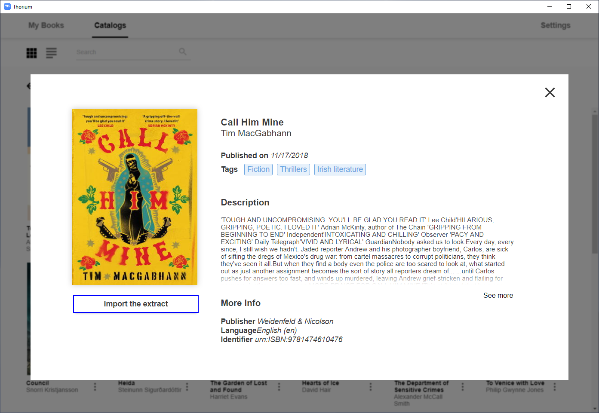
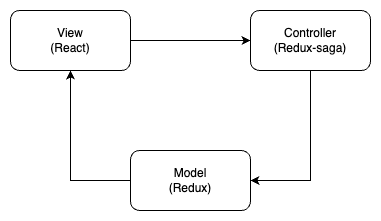
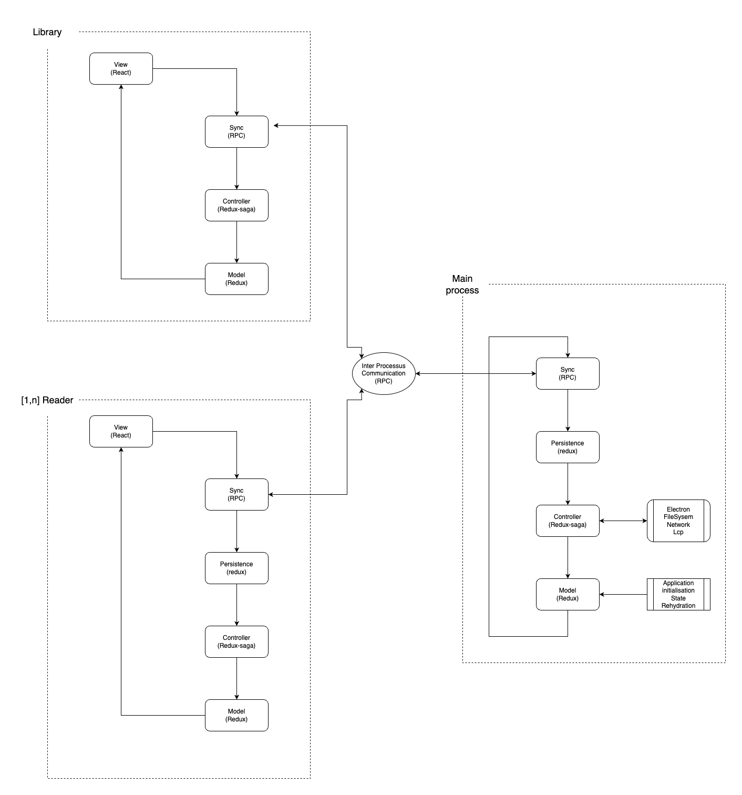
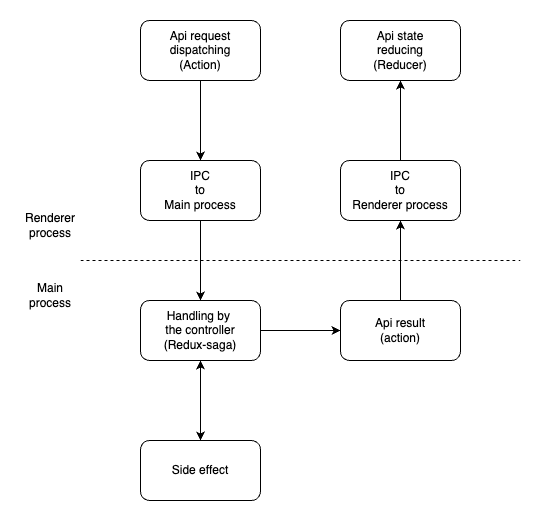

# Thorium Reader

Thorium Reader is an easy to use EPUB reading application for Windows 10/10S, MacOS and Linux. After importing e-books from a directory or OPDS feed, you'll be able to read on any screen size, customize layout settings, navigate via the table of contents or page list, set bookmarks ... A great care is taken to ensure the accessibility of the application for visual impaired people using NVDA, JAWS or Narrator.

Free application. No ads. No private data flowing anywhere.

This project is in constant evolution, corrections and new features will be added soon and your support is welcome for that. The application is based on the open-source Readium Desktop toolkit.

It is currently localized in following languages:
- English
- French
- Portuguese
- Swedish
- Russian
- Lithuanian
- Italian
- Japanese
- Dutch
- Spanish
- German
- Finnish
- Chinese (Simplified + Traditional)
- Korean
- Georgian
- Basque (Euskadi)
- Galician
- Catalan
- Croatian
- Bulgarian
- Greek

See: https://github.com/edrlab/thorium-reader/wiki/Localization-(l10n)-language-translations





## Prerequisites

1) NodeJS 16 (check with `node --version`)
2) NPM 8 (check with `npm --version`)

## Technologies

* typescript
* electron
* reactjs
* redux
* saga
* i18next

## Quick start

### Install dependencies

* `npm install` (or `npm ci`): initialize local `node_modules` packages from dependencies declared in `package.json` (this will also automatically call a long-running compilation stage in `npm run postinstall`)
* in case of failure to NPM "install" because of "Divina player" SHA integrity mismatch, please try running the following command in your shell: `node scripts/package-lock-patch.js && cat package-lock.json | grep -i divina-player-js`

### Start application in development environment

(with hot-reload dev server, web inspectors / debuggers)

* `npm run start:dev` (or `npm run start:dev:quick` to bypass TypeScript checks / launch the app faster)

### Start application in production environment

* `npm start` (or `npm run start`)

## Build installers

* `npm run package:win` or `npm run package:mac` or `npm run package:linux`

Code Signing information: https://github.com/edrlab/thorium-reader/wiki/Code-Signing

## Command line

```
thorium <cmd> [args]

Commands:
  thorium opds <title> <url>  import opds feed
  thorium import <path>       import epub or lpcl file
  thorium read <title>        searches already-imported publications with the
                              provided TITLE, and opens the reader with the
                              first match
  thorium [path]              import and read an epub or lcpl file     [default]
  thorium completion          generate bash completion script

Positionals:
  path  path of your publication, it can be an absolute, relative path  [string]

Options:
  --version  Show version number                                       [boolean]
  --help     Show help                                                 [boolean]
```

## [DEV] Architecture

Thorium-reader is composed of 3 parts:
- One node.js main process (electron back-end)
- One library window (chromium renderer)
- One to N reader window(s) (chromium renderer)

each part run a model-controler and a view for renderer process

- the model is a state container with [Redux](https://redux.js.org/). It's based on [flux architecture](https://github.com/facebookarchive/flux)
- the controller is a middleware from Redux named [Redux-saga](https://redux-saga.js.org/). It's handle all side effect and application behaviour.
- the view for the rendering is React with [class components](https://legacy.reactjs.org/docs/components-and-props.html)

To linked all 3 parts we used :
- IPC/RPC: we used implementation from [Electron](https://www.electronjs.org/docs/latest/api/ipc-main)
- React/Redux: We used [connect](https://react-redux.js.org/api/connect) from [react-redux](https://react-redux.js.org/).

### Diagram

#### [Model View Controller Architecture](https://en.wikipedia.org/wiki/Model%E2%80%93view%E2%80%93controller)





### API Concept

To have a type POST request from a renderer process to the main process we used the notion of API.
It's not an http API but an RPC encapsuled to redux/redux-saga logic with Action and Reducer.

This is a diagram of the communication:



Src:
- src/main/redux/sagas/api/api.ts
- src/common/redux/actions/api/index.ts
- src/renderer/common/redux/reducers/api.ts

At the moment there are 17 API endpoints from (src/main/redux/sagas/api) :

library:
- apiapp:
  - apiapp/search : search a library from apiapp protocol
- browser:
  - httpbrowser/browse : browse and parse an opds URL
- opds:
  - opds/getFeed : get an opdsFeed with is identifier
  - opds/findAllFeed: get all opdsFeed saved
  - opds/deleteFeed: delete an opdsFeed with is identifier
  - opds/addFeed: add an opdsFeed
  - opds/getUrlWithSearchLinks: get the search URL from an opdsFeed
- publication: (src/common/api/interface/publicationApi.interface.ts)
  - publication/get: get a publicationView from id
  - publication/delete: delete a publicationView from id
  - publication/findAll: get all publicationView
  - publication/findByTag: get all publicationView from a specific tag string
  - publication/updateTags: update tags list from a publication
  - publication/importFromLink: import a publication from an URL
  - publication/importFromFs: import a publication from a fileSystem path
  - publication/search: search publication from a query text
  - publication/searchEqTitrle: search publication by title matching
  - publication/exportPublication: export publication to the fileSystem


### ACTION-REDUCER

From main-process to renderer-process or from renderer-process to main-process.

List of all Actions in place (src/common/redux/actions) :

- auth: opds authentication
  - cancel
  - done
  - wipeData
- catalog
  - getCatalog: ask to rehydrate catalogView in libraryState
  - setCatalogView: response from getCatalog
  - setTagView: rehydrate tagStringView in libraryState
- dialog: modal dialog view in library,reader
  - closeRequest
  - openRequest
  - updateRequest
- download: download queue in library
  - abort
  - done
  - progress
- history: history opds feed
  - pushFeed
  - refresh
- i18n
  - setLocale
- import
  - verify: import verification process
- keyboard: keyboard shortcut
  - reloadShortcut
  - setShortcut
  - showShortcut
- lcp
  - renewPublication
  - returnPublication
  - unlockPublicationWithPassphrase
  - userKeyCheckRequest
- load: main proceess busy or not
  - busy
  - iddle
- net (not used)
- reader
  - attachMode
  - clipboardCopy
  - closeRequest
  - closeRequestFromPublication
  - configSetDefault
  - detachModeRequest
  - detachModeSuccess
  - fullScreenRequest
  - openRequest
  - openError
  - setReduxState: trigger app persistence
- session: saved session
  - enable
- toast: toast notification library,reader
  - close
  - open
